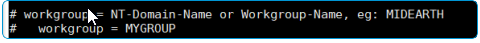

# UAG - Content Gateway – Domäne mitgeben

Wenn das Content Gateway auf dem UAG läuft, muss standardmäßig die Domäne mitgegeben werden.&#x20;

Dies ist nicht erforderlich, wenn alle Nutzer die selbe Domain verwenden. Dies kann in der smb Konfiguration des UAGs hinterlegt werden.&#x20;

Pfad der Konfig Datei:&#x20;

> /opt/airwatch/content-gateway/smb-connector/smb.conf

<figure><figcaption></figcaption></figure>
